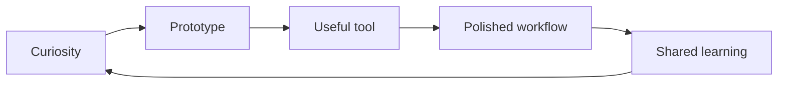

<div align="center">


[](https://git.io/typing-svg)

</div>

## Now

I am using this space as a living signal for what I am building, learning, and reaching for next.

```txt
focus        practical AI tooling, automation, and polished web experiences
building     small utilities that remove friction from everyday work
learning     better product taste, sharper systems design, and faster feedback loops
values       clarity, durability, thoughtful interfaces, and code that feels calm to revisit
```

## Working With

<div align="center">


</div>

## Current Shape

<table>
  <tr>
    <td width="50%">
      <h3>Build</h3>
      <p>Turning fuzzy ideas into useful tools, then sanding down the rough edges until they feel obvious.</p>
    </td>
    <td width="50%">
      <h3>Automate</h3>
      <p>Finding repeatable work, making it reliable, and giving future-me one less thing to babysit.</p>
    </td>
  </tr>
  <tr>
    <td width="50%">
      <h3>Design</h3>
      <p>Interfaces that are fast to scan, hard to break, and pleasant without trying too loudly.</p>
    </td>
    <td width="50%">
      <h3>Learn</h3>
      <p>Keeping a tight loop between curiosity, experiments, and shipping something concrete.</p>
    </td>
  </tr>
</table>

## Signal

<div align="center">


</div>

## Direction



<div align="center">


</div>
